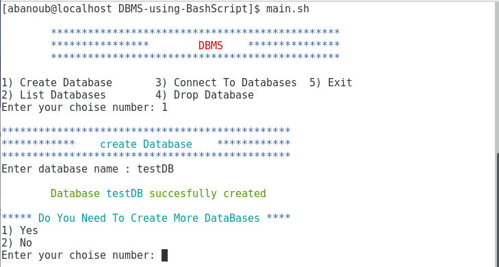
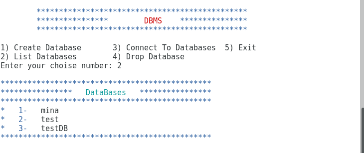
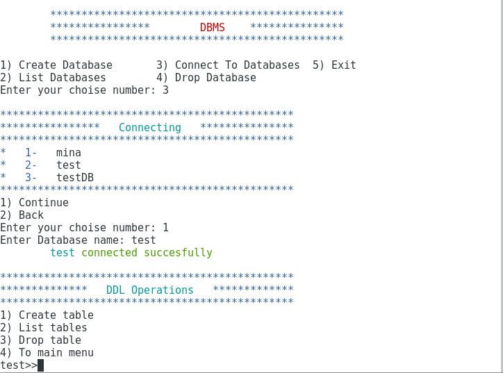
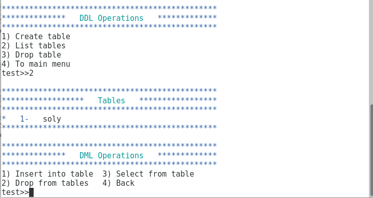

<h1 align="center">DBMS-using-BashScript</h1>   
<h3>ITI students, IoT departments intake 42 (2022)</h3>  

<p align="center">
  
</p>


## OBJECTIVE
This project aims to develop a Data Base Management System (DBMS) using Bash Script.


## DBMS
DBMS is a software used to facilitate and manage dealing with Databases in creation and manipulation.


## picture samples from our project
### List the existence Databases 
<p align="center">
  
</p>
### Connect to a Database and show the available Data Definition Language (DDL)
<p align="center">
  
</p>
### List the existence tables in a Database and  show the available Data Manibulation Language (DML)
<p align="center">
  
</p>


<!--## Video Link 
- 
-->
## Contributors
- Ahmed El khouly
- Abanoub Kamal


## Getting Started
### Installation

```
get clone from this Repo
Open Bash and write git clone and the link

```


## License
this project under the GNU General Public License v2.0.

